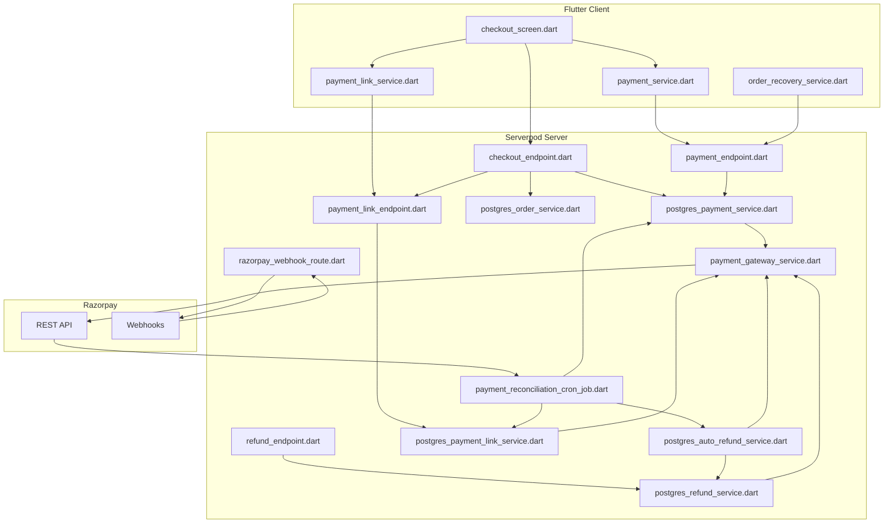

# Payment Flow Report — FreshPickKat

## Overview

The app supports **three payment methods** at checkout, plus a **COD collection flow** for admin delivery:

| Method | Client-Side Name | Flags | Gateway Mechanism |
|--------|------------------|-------|-------------------|
| **Pay Now** | "Pay Now" (default) | `_isShareablePayment=false`, `_isCodPayment=false` | Razorpay UPI Intent (app-to-app) |
| **Cash on Delivery** | "Cash on Delivery" | `_isCodPayment=true`, `_isShareablePayment=false` | No gateway — order confirmed immediately; payment collected at delivery by admin |
| **Ask Someone Else To Pay** | "Ask Someone Else To Pay" | `_isShareablePayment=true`, `_isCodPayment=false` | Shareable payment link (browser checkout or Razorpay-hosted link) |

### Coverage

| Module | Scope | Status |
|--------|-------|--------|
| **Module 0** | Pay Now — Direct UPI | Production |
| **Module 1** | Cash on Delivery — Order Creation | Production |
| **Module 2** | Cash on Delivery — Payment Collection, Delivery Guards, Admin UI, User UI | Production |
| Module 3 | COD Abuse Prevention — Auto-Blocking, Trust Recovery, Admin Failure Recording | Production |

| Method | Client-Side Name | Flags | Gateway Mechanism |
|--------|------------------|-------|-------------------|
| **Pay Now** | "Pay Now" (default) | `_isShareablePayment=false`, `_isCodPayment=false` | Razorpay UPI Intent (app-to-app) |
| **Cash on Delivery** | "Cash on Delivery" | `_isCodPayment=true`, `_isShareablePayment=false` | No gateway — order confirmed immediately |
| **Ask Someone Else To Pay** | "Ask Someone Else To Pay" | `_isShareablePayment=true`, `_isCodPayment=false` | Shareable payment link (browser checkout or Razorpay-hosted link) |

---

## 1. Pay Now — Direct UPI Flow

### 1.1 High-Level Flow

```
User taps "PLACE ORDER"
  │
  ▼
PlaceOrder decision matrix
  │  (handles existing pending orders, cart changes, timeouts)
  ▼
_placeOrderCore(pendingOrderAction?)
  │
  ├─ Validates: address (lat/lng), phone, Razorpay key
  ├─ _buildOrderFromCart() → constructs Order with all items, discounts, FreshPoints
  │
  ▼
checkoutService.createOrderAndPayment()
  │
  ├─ Server: OrderEndpoint.createPendingOrder()
  │   ├─ PricingEngine.calculateCartPricing()  ← server-authoritative
  │   ├─ DB Transaction (FOR UPDATE):
  │   │   ├─ Resolve/create user
  │   │   ├─ Idempotency check (same key → same order)
  │   │   ├─ Insert CustomerOrderRow (paymentStatus='pending', orderStatus='placed')
  │   │   ├─ Insert OrderItemRow (x N items)
  │   │   ├─ Insert OrderAddressRow
  │   │   ├─ Insert PaymentTransactionRow (amount, paymentStatus='pending')
  │   │   ├─ FreshPoints redemption (if applicable)
  │   │   └─ Insert IdempotencyRecordRow
  │   └─ Returns orderNumber (e.g. "ORD1234567890123")
  │
  ├─ Server: getOrderActualPaymentAmount()  (post-FreshPoints reduction)
  │
  ├─ Server: PaymentEndpoint.createPaymentOrder()
  │   ├─ Validates: order exists, not paid, not cancelled
  │   ├─ Razorpay API POST /orders  (amount in paise, currency INR, receipt = order#)
  │   ├─ Update PaymentTransactionRow: gatewayOrderId, paymentStatus='pending', gatewayStatus='created'
  │   └─ Returns razorpayOrderId
  │
  └─ Server: initializePaymentSession()  (generates UUID paymentSessionId)
  │
  ▼
Client receives: {orderId, razorpayOrderId, amount}
  │
  ▼
_showUpiAppSelection()  →  user picks PhonePe / GPay / Paytm / BHIM / Enter VPA
  │
  ▼
_submitUpiPayment()
  │
  ├─ Builds Razorpay options: {key, amount(paise), order_id, method:'upi', vpa, flow:'intent', packageName}
  └─ _razorpay.submit(options)   ← opens UPI app
  │
  ▼
  ┌─────────────────┬──────────────────┐
  │ EVENT_SUCCESS   │ EVENT_ERROR       │
  ├─────────────────┼──────────────────┤
  │                 │                  │
  ▼                 ▼                  ▼
_handlePaymentSuccess          _handlePaymentError
  │                               │
  ├─ Extract {razorpay_order_id,  ├─ Extract error details + payment_id
  │   razorpay_payment_id,        ├─ _tryResolvePendingUpiPayment()
  │   razorpay_signature}         │   (1 attempt if cancelled, 20 if not)
  │                               │   ├─ Polls getPaymentStatus() every 3s
  │                               │   ├─ If 'captured'/'authorized':
  │                               │   │   verifyPayment() → complete
  │                               │   ├─ If orderPaymentStatus == 'paid':
  │                               │   │   _completeSuccessfulPayment()
  │                               │   └─ If NOT resolved after N attempts → fail
  ├─ paymentService.completeOrder()│
  │   ├─ Cache PendingPaymentRecord│  └─ _markPaymentFailedBestEffort()
  │   ├─ client.payment.verifyPayment()  →  server
  │   │   └─ HMAC validation + FOR UPDATE transaction: mark 'paid'/'confirmed'
  │   ├─ On success → remove cache  │
  │   └─ On failure → cache stays    │
  │                                  │
  ▼                                  ▼
_completeSuccessfulPayment()     Show error banner
  │                               Update _pendingOrderInfo.paymentStatus = 'failed'
  ├─ Clear cart                   
  ├─ Remove coupon                
  ├─ orderController.clearTempDeliveryAddress()
  └─ Get.offAll → OrderConfirmationScreen
```

### 1.2 Key Client-Side Files

| File | Purpose |
|------|---------|
| `checkout_screen.dart` (~3500 lines) | Main checkout screen — all payment logic (incl. COD) |
| `payment_service.dart` (147 lines) | `completeOrder()`, `markPaymentFailed()`, `pollPaymentStatus()`, `verifyPayment()` |
| `payment_link_service.dart` (59 lines) | `createShareablePaymentLink()`, `getOrCreatePaymentLink()`, `getPaymentSessionStatus()` |
| `order_recovery_service.dart` (259 lines) | `recoverPendingPayments()` — local pending payment recovery |

### 1.3 Key Server-Side Files

| File | Purpose |
|------|---------|
| `checkout_endpoint.dart` | `createOrderAndPayment()`, `createCodOrder()`, `_handleContinuePayment()`, `getCheckoutInitHydrated()` |
| `postgres_order_service.dart` (~2500 lines) | `createPendingOrder()`, `createCodOrder()`, `cancelPendingOrder()`, `requestCancellation()`, `approveCancellationRequest()` |
| `postgres_payment_service.dart` (1898 lines) | `createPaymentOrder()`, `verifyPayment()`, `completePaymentVerification()`, `markPaymentFailed()` |
| `postgres_payment_link_service.dart` (955 lines) | `createPaymentLink()`, `createRazorpayPaymentLink()`, `getOrCreatePaymentLink()`, `disablePaymentLink()` |
| `postgres_refund_service.dart` (534 lines) | `initiateRefund()`, `refund()`, `handleRefundWebhook()` |
| `postgres_auto_refund_service.dart` (176 lines) | `createJob()`, `loadPendingJobs()`, `updateJobStatus()` |
| `payment_gateway_service.dart` (214 lines) | HTTP client for Razorpay API (orders, payments, refunds, payment links) |
| `razorpay_webhook_route.dart` (~880 lines) | Webhook handler: `payment.captured`, `payment_link.paid`, `refund.*`, etc. (incl. COD guard) |
| `payment_reconciliation_cron_job.dart` (590 lines) | 10 isolated cron timers for reconciliation, expiry, auto-refund |

---

## 2. Ask Someone Else To Pay — Shareable Payment Link Flow

### 2.1 High-Level Flow

```
User selects "Ask Someone Else To Pay" radio option
  │  _isShareablePayment = true
  ▼
User taps "PLACE ORDER"
  │
  ▼
PlaceOrder decision matrix
  │  If pending order exists: routes through same matrix with shareable-path
  │  If no pending order: _placeOrder() → _placeOrderWithShareableLink()
  ▼
_placeOrderWithShareableLink(pendingOrderAction?)
  │
  ├─ Validates address, phone
  ├─ Generates idempotency key (userId + microseconds + random)
  │
  ▼
paymentLinkService.createShareablePaymentLink()
  → client.paymentLink.createShareablePaymentLink()
  │
  ├─ Server: PaymentLinkEndpoint.createShareablePaymentLink()
  │   ├─ If pendingOrderAction == 'cancel': cancels existing pending order
  │   ├─ OrderEndpoint.createPendingOrder()  (same as Pay Now — full server pricing)
  │   ├─ Two modes:
  │   │   A) Browser Checkout (ENABLE_WEB_CHECKOUT=true):
  │   │   │   ├─ createPaymentOrder() → Razorpay POST /orders
  │   │   │   ├─ Insert payment_link row (32-char random token, 20min expiry)
  │   │   │   └─ Return: {token, paymentLink: '/pay/{token}', expiresAt}
  │   │   │
  │   │   B) Razorpay Payment Links API (default):
  │   │   │   ├─ PaymentGatewayService.createPaymentLink()
  │   │   │   │   → Razorpay POST /payment_links
  │   │   │   ├─ Store razorpayPaymentLinkId + razorpayPaymentLinkUrl
  │   │   │   ├─ Update PaymentTransactionRow with gatewayOrderId
  │   │   │   └─ Return: {token, paymentLink: 'https://rzp.io/...', expiresAt}
  │   │
  │   ├─ Update CustomerOrderRow:
  │   │   ├─ paymentMode = 'shareable_link' or 'THIRD_PARTY_LINK'
  │   │   ├─ paymentLinkUrl, paymentLinkExpiresAt, linkStatus = 'ACTIVE'
  │   │   └─ paymentSessionId = UUID
  │   └─ Returns PaymentLinkData {success, token, paymentLink, expiresAt, orderId}
  │
  ▼
Client stores state:
  ├─ _pendingOrderInfo = {expiresInMinutes: 20, linkStatus: 'ACTIVE', ...}
  ├─ _activePaymentLink = paymentLink URL
  ├─ _linkPaymentReceived = false
  └─ _startLinkCardTimer()  (every 2s, updates countdown display)
  │
  ▼
_showSharePaymentLinkSheet()
  ├─ Bottom sheet with:
  │   ├─ Pre-composed message: "Hi, can you please complete the payment..."
  │   ├─ Countdown timer (20 min from creation)
  │   ├─ COPY LINK button
  │   └─ SHARE button (native share sheet)
  │
  └─ Also: _startPaymentStream(orderId)  (SSE for real-time payment status)
  │
  ▼
  ┌─────────────────────────────────────────┐
  │   PAYEE RECEIVES LINK, OPENS IN BROWSER │
  └─────────────────┬───────────────────────┘
                    │
                    ▼
  ┌──────────────────────────────────────────────────┐
  │  Browser Checkout Path (token-based)             │
  │  GET /pay/{token}                                │
  │    → validateToken()                             │
  │    → Renders HTML page with:                     │
  │        - Order summary (items, amount, address)  │
  │        - Payer details form (name, phone, email) │
  │        - Countdown timer (real-time)             │
  │        - Razorpay Checkout.js                    │
  │    → Payer clicks "Pay Now" → Razorpay Checkout  │
  │    → On success, POST /pay/confirm:              │
  │        {token, razorpay_payment_id,              │
  │         razorpay_order_id, razorpay_signature}   │
  │      → confirmPaymentRoute:                      │
  │          verifyPaymentFromLink() → HMAC + TXN    │
  │      → Redirect to /pay/success/{token}          │
  └─────────────────┬────────────────────────────────┘
                    │
  ┌──────────────────────────────────────────────────┐
  │  Razorpay Payment Link Path (rzp.io)             │
  │  Payer opens https://rzp.io/...                  │
  │    → Razorpay-hosted checkout page               │
  │    → Payer completes payment                     │
  │    → Razorpay sends webhook:                     │
  │        payment_link.paid                         │
  │      → Webhook handler:                          │
  │          completePaymentVerification()            │
  │          (same FOR UPDATE transaction)           │
  └─────────────────┬────────────────────────────────┘
                    │
                    ▼
  ┌──────────────────────────────────────────────────┐
  │  RECONCILIATION (fallback)                       │
  │  Every 5 min: reconcilePaymentLinkOrders()       │
  │    → Fetches Razorpay payment link status        │
  │    → If paid → completePaymentVerification()     │
  └─────────────────┬────────────────────────────────┘
                    │
                    ▼
  ┌──────────────────────────────────────────┐
  │  Client receives PaymentEvent via SSE     │
  │  → _linkPaymentReceived = true           │
  │  → Auto-close share sheet (if open)      │
  │  → _completeSuccessfulPayment(orderId)   │
  │  → Navigate to OrderConfirmationScreen   │
  └──────────────────────────────────────────┘
```

### 2.2 Payment Link Lifecycle

```
                  ┌──────────────┐
                  │ ORDER        │
                  │ CREATED      │
                  │ linkStatus:   │
                  │ 'ACTIVE'     │
                  │ 20min expiry │
                  └──────┬───────┘
                         │
         ┌───────────────┼───────────────┐
         ▼               ▼               ▼
  ┌────────────┐  ┌────────────┐  ┌───────────────┐
  │ PAID       │  │ EXPIRED    │  │ CANCELLED     │
  │ (webhook   │  │ (20min     │  │ by user/admin │
  │  or poll)  │  │  passed)   │  │               │
  └─────┬──────┘  └─────┬──────┘  └───────┬───────┘
        │               │                 │
        ▼               ▼                 ▼
  linkStatus:     linkStatus:        linkStatus:
  'DISABLED'      'EXPIRED'          'DISABLED'
  orderStatus:    orderStatus:       orderStatus:
  'confirmed'     'payment_expired'  'cancelled_by_user'
  paymentStatus:  paymentStatus:     paymentStatus:
  'paid'          'cancelled'        'cancelled'
```

---

## 3. Cash on Delivery — No-Payment Flow

### 3.1 When Is COD Available?

COD is available as a radio option in the payment method selector. When selected (`_isCodPayment=true`), the order is confirmed **without any payment gateway interaction**.

### 3.2 High-Level Flow

```
User selects "Cash on Delivery" radio option
  │  _isCodPayment = true, _isShareablePayment = false
  ▼
User taps "PLACE ORDER"
  │
  ▼
_handlePendingOrderOnPlaceOrder()
  │  COD always clears _pendingOrderInfo and routes to _placeOrderCod()
  │  (no pending-payment continuation for COD)
  ▼
_placeOrderCod()
  │
  ├─ Validates: address (lat/lng), phone
  ├─ _buildOrderFromCart() → constructs Order (same as Pay Now)
  │
  ▼
checkoutService.createCodOrder(order, idempotencyKey, freshPointsToRedeem)
  │
  ├─ Server: CheckoutEndpoint.createCodOrder()
  │   ├─ Sets order.paymentMode = 'cod'
  │   │
  │   ├─ OrderEndpoint.createCodOrder()
  │   │   ├─ PostgresOrderService.createCodOrder()
  │   │   │   ├─ FreshPoints guard: checks allowRedemptionOnCOD setting
  │   │   │   │   → Throws if false and freshPointsToRedeem > 0
  │   │   │   │
  │   │   │   ├─ PricingEngine.calculateCartPricing()  ← server-authoritative
  │   │   │   │   (same pricing engine as Pay Now)
  │   │   │   │
  │   │   │   ├─ DB Transaction (FOR UPDATE):
  │   │   │   │   ├─ Resolve/create user
  │   │   │   │   ├─ Idempotency check (same key → same order)
  │   │   │   │   ├─ Insert CustomerOrderRow:
  │   │   │   │   │   ├─ paymentStatus = 'pending'
  │   │   │   │   │   ├─ orderStatus = 'confirmed'    ← confirmed immediately
  │   │   │   │   │   ├─ paymentMode = 'cod'
  │   │   │   │   │   ├─ confirmedAt = now()
  │   │   │   │   │   └─ No payment/link fields set
  │   │   │   │   ├─ Insert OrderItemRow (x N items, with snapshots)
  │   │   │   │   ├─ Insert OrderAddressRow (frozen snapshot)
  │   │   │   │   ├─ FreshPoints redemption (if allowRedemptionOnCOD)
  │   │   │   │   ├─ _deductStockInternal()  ← deducts inventory immediately
  │   │   │   │   ├─ Clear user cart
  │   │   │   │   ├─ Increment coupon usage count
  │   │   │   │   └─ Insert IdempotencyRecordRow
  │   │   │   │
  │   │   │   └─ Returns orderNumber (e.g. "COD1234567890123")
  │   │   │
  │   │   └─ Returns orderNumber
  │   │
  │   ├─ Post-transaction (fire-and-forget):
  │   │   ├─ OrderOutboxService.enqueueOrderStatusChanged('confirmed')
  │   │   ├─ referralService.checkOrderForReward()
  │   │   │   (COD can trigger referral rewards if rewardTriggerStatus='confirmed')
  │   │   └─ RedisAnalyticsService.processPaidOrder()
  │   │       (wrapped in try-catch — non-blocking on failure)
  │   │
  │   └─ Returns CheckoutResult(success: true, orderId: orderNumber)
  │
  ▼
Client receives {success: true, orderId}
  │
  ├─ No _pendingOrderInfo set (COD has no pending payment)
  ├─ No Razorpay order created
  ├─ No payment stream started
  │
  ▼
_completeSuccessfulPayment(orderId)
  │
  ├─ Clear cart
  ├─ Remove coupon
  ├─ orderController.clearTempDeliveryAddress()
  └─ Get.offAll → OrderConfirmationScreen
```

### 3.3 Key Differences from Pay Now / Shareable Link

| Aspect | Pay Now / Link | COD |
|--------|---------------|-----|
| **Order status after creation** | `placed` | `confirmed` |
| **Payment status** | `pending` (gateway) | `pending` (no gateway) |
| **confirmedAt** | Set by `verifyPayment()` / webhook | Set at order creation |
| **Razorpay order** | Created via `POST /orders` | Not created |
| **Payment link** | Generated (if shareable) | Not generated |
| **Stock deduction** | At payment confirmation | At order creation |
| **FreshPoints** | Only if `allowRedemptionOnCOD=true` | Only if `allowRedemptionOnCOD=true` |
| **Webhook guard** | Normal processing | Early return — "COD order — skipped" |

### 3.4 COD Order Lifecycle

```
                  ┌──────────────┐
                  │ ORDER        │
                  │ CREATED      │
                  │ orderStatus: │
                  │ 'confirmed'  │
                  │ paymentMode: │
                  │ 'cod'        │
                  │ paymentStatus│
                  │ 'pending'    │
                  └──────┬───────┘
                         │
                         ▼
                  ┌──────────────┐
                  │ PAYMENT      │
                  │ COLLECTION   │
                  │ (admin       │
                  │  collects    │
                  │  cash/UPI QR)│
                  │ paymentStatus│
                  │ → 'paid'     │
                  └──────┬───────┘
                         │
            ┌────────────┼────────────┐
            ▼            ▼            ▼
     ┌──────────┐  ┌──────────┐  ┌──────────┐
     │ DELIVERED│  │ CANCELLED│  │ REFUNDED │
     │ (OTP or  │  │ (by user │  │ (COD     │
     │  photo)  │  │ or admin)│  │  refund) │
     └──────────┘  └──────────┘  └──────────┘
```

**COD Collection** (added to `customer_order` table):
| Column | Type | Purpose |
|--------|------|---------|
| `paymentCollectedAt` | `timestamp` | When delivery agent collected payment |
| `paymentCollectedBy` | `text` | Delivery agent ID or name |
| `paymentCollectionMode` | `text` | e.g. `cash`, `upi_qr`, `card_swipe` |

These fields are populated by the admin payment collection flow (see §3.6).

### 3.5 Key Server-Side Files Added/Modified

| File | Changes |
|------|---------|
| `postgres_order_service.dart` | New `createCodOrder()` method (~110 lines) — confirmed order with stock deduction |
| `postgres_order_service.dart` | `updateOrderStatus()` — stock restoration also for `paymentMode='cod'` |
| `postgres_order_service.dart` | `approveCancellationRequest()` — stock restoration also for `paymentMode='cod'` |
| `postgres_order_service.dart` | `findActivePendingOrder()` — excludes orders with `orderStatus='confirmed'` |
| `postgres_order_service.dart` | New `collectCodPayment()` — sets `paymentStatus='paid'` + collection metadata |
| `postgres_order_service.dart` | `_hydrateOrders()` — maps `paymentMode`, `paymentCollectedAt`, `paymentCollectedBy`, `paymentCollectionMode` to `Order` DTO |
| `order_endpoint.dart` | New `createCodOrder()` wrapper endpoint |
| `order_endpoint.dart` | New `collectCodPayment()` — admin-only, audit log `collect_cod_payment` |
| `order_endpoint.dart` | COD payment guard in `generateDeliveryOtp()` — rejects unpaid COD |
| `order_endpoint.dart` | COD payment guard in `markDeliveryPhotoPending()` — rejects unpaid COD |
| `order_endpoint.dart` | COD payment guard in `completePhotoDelivery()` — rejects unpaid COD |
| `postgres_delivery_verification_service.dart` | COD payment guard in `completePhotoDelivery()` — defense-in-depth |
| `checkout_endpoint.dart` | New `createCodOrder()` endpoint — outbox + analytics + referral |
| `razorpay_webhook_route.dart` | COD guard — early returns for `paymentMode='cod'` orders |
| `validation_service.dart` | Added `cancelled_by_user` → `confirmed` transition |

### 3.6 Key Client-Side Files Added/Modified

| File | Changes |
|------|---------|
| `checkout_service.dart` | New `createCodOrder()` method |
| `order_service.dart` | New `createCodOrder()` method |
| `checkout_screen.dart` | New `_placeOrderCod()` method + COD radio button in `_buildPaymentSection()` |
| `checkout_screen.dart` | `_handlePendingOrderOnPlaceOrder()` — early route to `_placeOrderCod()` when `_isCodPayment=true` |
| `checkout_screen.dart` | `_placeOrderCore()` — early guard re-routes to `_placeOrderCod()` |
| `admin_order_controller.dart` | New `collectCodPayment(order, collectionMode)` — calls endpoint |
| `order_detail_screen.dart` (admin) | `_buildCodPaymentCollectionSection()` — Cash/UPI QR buttons |
| `order_detail_screen.dart` (admin) | `_collectCodPayment()` handler with confirm dialog + setState |
| `order_detail_screen.dart` (admin) | COD collection details in Payment & Timeline section |
| `order_confirmation_screen.dart` (user) | "Pay on Delivery" subtitle for COD orders |
| `order_confirmation_screen.dart` (user) | "Pay on Delivery" label in pricing breakdown |
| `order_detail_screen.dart` (user) | COD badge chip + "Pay on Delivery" in pricing |
| `orders_screen.dart` (user) | COD badge on order cards |

### 3.7 Admin Payment Collection Flow (Module 2)

When an order reaches `out_for_delivery` status and it's a COD order (`paymentMode='cod'`) with unpaid payment (`paymentStatus='pending'`), the admin **must collect payment before delivery**.

#### Admin Order Detail Screen — COD Collection UI

```
Order Detail Screen (admin)
  │
  ├── Payment & Timeline section
  │   ├── Payment status chip (PENDING — warning color)
  │   ├── Timeline: Ordered, Confirmed, Out for Delivery, Delivered
  │   └── IF collected: COD: ₹X, Collected by: name, Mode: Cash/UPI QR
  │
  └── Lifecycle Actions section
      │
      └── IF paymentMode == 'cod' AND paymentStatus != 'paid':
          → _buildCodPaymentCollectionSection()
              ┌─────────────────────────────────────────────┐
              │ 💵 Collect COD Payment                      │
              │ Collect ₹X.XX before delivery.              │
              │ ┌──────────┐  ┌──────────┐                  │
              │ │   Cash   │  │ UPI QR   │                  │
              │ └──────────┘  └──────────┘                  │
              └─────────────────────────────────────────────┘
              │
              ├── Cash: Confirm dialog → "Collect Cash ₹X.XX?"
              │   → _orderController.collectCodPayment(order, 'cash')
              │   → Server: paymentStatus='paid', paymentCollectedAt=now()
              │   → setState: _order.paymentStatus = 'paid'
              │   → Photo/OTP/Track buttons appear
              │
              └── UPI QR: Same flow with collectionMode='upi_qr'
```

#### Server-Side `collectCodPayment()` Flow

```
OrderEndpoint.collectCodPayment(orderId, collectionMode)
  │
  ├── Admin auth: ensureAdminSeller(firebaseUid, idToken)
  │
  ├── PostgresOrderService.collectCodPayment()
  │   ├── Fetch CustomerOrderRow
  │   ├── Guard: paymentMode == 'cod'  (rejects non-COD orders)
  │   ├── Guard: paymentStatus != 'paid'  (rejects already collected)
  │   ├── Guard: orderStatus not in ['delivered', 'cancelled']
  │   ├── Guard: collectionMode in ['cash', 'upi_qr']  (rejects invalid modes)
  │   │
  │   ├── UPDATE CustomerOrderRow:
  │   │   ├── paymentStatus = 'paid'
  │   │   ├── paymentCollectedAt = now()
  │   │   ├── paymentCollectedBy = adminFirebaseUid
  │   │   └── paymentCollectionMode = collectionMode
  │   │
  │   └── Return (no PaymentTransactionRow created — COD has no gateway)
  │
  └── Audit log: action='collect_cod_payment', metadata={collectionMode}
```

### 3.8 Delivery Verification Guards (Module 2)

Before any delivery verification can proceed on COD orders, the system **enforces payment collection** at 3 guard points:

```
┌─────────────────────────────────────────────────────────────────────┐
│  COD Payment Must Be Collected Before Delivery                      │
│  Guard: if (paymentMode == 'cod' && paymentStatus != 'paid')       │
│         → throw StateError("COD payment must be collected...")      │
└─────────────────────────────────────────────────────────────────────┘

  Guard Point 1: generateDeliveryOtp()      (OrderEndpoint)
    → Called when admin taps "OTP Delivery"
    → Before status check, after null check
    → Rejects with StateError if COD unpaid

  Guard Point 2: markDeliveryPhotoPending() (OrderEndpoint)
    → Called when admin taps "Photo Delivery"
    → Before status check, after null check
    → Rejects with StateError if COD unpaid

  Guard Point 3: completePhotoDelivery()    (OrderEndpoint + Service)
    → Called when admin completes photo delivery
    → Guarded in BOTH the endpoint AND the service layer
    → Defense-in-depth: even if endpoint is bypassed, service catches it
```

#### What Happens on the Admin Screen

```
out_for_delivery + COD unpaid:
  ┌─────────────────────────────────────────────┐
  │ 💵 Collect COD Payment Required              │
  │                                             │
  │ [Cash]  [UPI QR]                            │
  └─────────────────────────────────────────────┘
  (Photo/OTP/Track buttons are hidden)

out_for_delivery + COD paid:
  ┌─────────────────────────────────────────────┐
  │ 📷 Photo Delivery  │ 🔢 OTP Delivery       │
  │ 🗺️ Track           │                        │
  └─────────────────────────────────────────────┘
  (Delivery buttons visible — guards pass)
```

### 3.9 COD Abuse Prevention — Auto-Blocking & Trust Recovery (Module 3)

To prevent abuse of the COD payment method (e.g., repeated refusals, fake addresses), the system implements a progressive penalty system.

#### Mechanism

```
User places COD order
  → codOrdersPlaced++  (at order creation)
  └── If order delivered successfully
      → codOrdersDelivered++  (at status='delivered')
      → _autoUnblockCodIfEligible()  ← trust recovery

If delivery fails (admin records failure)
  → codOrdersRejected++  (at markCodDeliveryFailed)
  → _checkAutoBlockCod()
    └── If codOrdersRejected >= maximumAllowedCodFailures (default: 3)
        → isCodBlocked = true
        → codBlockedReason = 'REPEATED_DELIVERY_REFUSAL'
        → codBlockedAt = now()
        → Future COD orders blocked at:
            • CheckoutEndpoint.getCheckoutInitHydrated() → codAvailable=false
            • CheckoutEndpoint.createCodOrder() → returns error
```

#### Trust Recovery (Automatic Unblock)

Counters **never reset**, but blocked users regain COD access when they demonstrate reliability:

```
User completes a prepaid (ONLINE / SHAREABLE_LINK) order
  → updateOrderStatus('delivered') or completePhotoDelivery()
  → _autoUnblockCodIfEligible():
    └── IF isCodBlocked == true
        AND new order.paymentMode IN ('standard', 'shareable_link')
        AND new order.paymentStatus == 'paid'
        AND new order.orderStatus == 'delivered'
        → isCodBlocked = false
        → codBlockedReason = null
        → codBlockedAt = null
```

This means users cannot bypass the block by just placing a COD order — they must use a prepaid method and complete it successfully.

#### Admin Failure Recording Flow

```
Admin Order Detail Screen
  │  IF paymentMode == 'cod' AND orderStatus == 'out_for_delivery'
  ▼
"Mark Delivery Failed" button
  │
  ├── Opens dialog: Select failure reason
  │    └── Options:
  │        • Customer Refused
  │        • Customer Unavailable
  │        • Refused to Pay
  │        • Address Not Found
  │        • Delivery Failed
  │        • Other
  │
  ├── Optional: failure note (text field)
  │
  ▼
orderController.markCodDeliveryFailed(orderNumber, reason, failureNote)
  → Server: OrderEndpoint.markCodDeliveryFailed()
    │
    ├── Guard: paymentMode == 'cod'
    ├── Guard: codFailureReason == null (one failure per order)
    ├── Guard: orderStatus == 'out_for_delivery'
    │
    ├── FOR UPDATE Transaction:
    │   ├── CustomerOrderRow.orderStatus = 'cancelled'
    │   ├── CustomerOrderRow.codFailureReason = reason
    │   ├── CustomerOrderRow.cancelledAt = now()
    │   ├── CustomerOrderRow.cancellationReason = 'COD_DELIVERY_FAILURE: {reason}'
    │   │
    │   ├── Insert CodFailureRecord:
    │   │   ├── orderId (UUID, UNIQUE)
    │   │   ├── userId (UUID)
    │   │   ├── reason (enum: 6 values)
    │   │   ├── failureNote (optional text)
    │   │   ├── recordedBy (admin ID)
    │   │   └── recordedAt (timestamp)
    │   │
    │   ├── AppUserRow.codOrdersRejected += 1
    │   │
    │   └── Auto-block check:
    │       IF codOrdersRejected >= settings.maximumAllowedCodFailures
    │       AND settings.enableAutoBlocking == true
    │       → AppUserRow.isCodBlocked = true
    │       → AppUserRow.codBlockedReason = 'REPEATED_DELIVERY_REFUSAL'
    │       → AppUserRow.codBlockedAt = now()
    │
    └── Note: Stock reversal handled by existing cancellation logic
          (updateOrderStatus → restoreStock at order level)
```

#### Delivery Failure Reasons (Enum)

| Reason Code | Label (Admin UI) | When to Use |
|-------------|------------------|-------------|
| `CUSTOMER_REFUSED` | Customer Refused | Customer refuses to accept delivery |
| `CUSTOMER_UNAVAILABLE` | Customer Unavailable | Customer not at address after multiple attempts |
| `PAYMENT_REFUSED` | Refused to Pay | Customer wants the goods but refuses to pay |
| `ADDRESS_NOT_FOUND` | Address Not Found | Delivery location does not exist / incorrect |
| `DELIVERY_FAILED` | Delivery Failed | Generic delivery failure (vehicle, weather, etc.) |
| `OTHER` | Other | Any other reason (free text) |

#### New Tables

| Table | Key | Purpose |
|-------|-----|---------|
| `cod_settings` | Singleton row | `maximumAllowedCodFailures` (int, default 3), `enableAutoBlocking` (bool, default true) |
| `cod_failure_record` | orderId (UNIQUE FK) | Every recorded COD failure, with reason, note, recorder identity, timestamp |

#### Database Columns Added

| Table | Column | Type | Purpose |
|-------|--------|------|---------|
| `app_user` | `codOrdersPlaced` | int (default 0) | Lifetime COD orders placed |
| `app_user` | `codOrdersDelivered` | int (default 0) | Lifetime COD orders delivered successfully |
| `app_user` | `codOrdersRejected` | int (default 0) | Lifetime COD delivery failures |
| `app_user` | `isCodBlocked` | boolean (default false) | Whether COD is blocked for this user |
| `app_user` | `codBlockedReason` | text | Reason for COD block |
| `app_user` | `codBlockedAt` | timestamp | When the block was applied |
| `customer_order` | `codFailureReason` | text | Failure reason for COD delivery |

#### Configuration

| Variable | Default | Purpose |
|----------|---------|---------|
| `maximumAllowedCodFailures` | 3 | Number of failed COD deliveries before auto-block |
| `enableAutoBlocking` | true | Master switch for auto-blocking |

#### Key Architecture Decisions

1. **Counters never reset** — permanent record of behavior prevents abuse cycling
2. **Trust recovery is automatic** — no admin intervention needed; prepaid delivery triggers unblock
3. **No admin unblock endpoint** — trust must be earned, not granted by support
4. **Single CodFailureRecord per order** — UNIQUE constraint on orderId prevents duplicate recording

---

### 3.10 User-Facing COD Display (Module 2)

| Screen | What Changed |
|--------|-------------|
| **Order Confirmation** (post-checkout) | Shows "Pay on Delivery" subtitle instead of "Payment Pending" |
| **Order Confirmation** (pricing) | Shows "Pay on Delivery: ₹X" instead of "Paid via UPI/Card" |
| **Order Detail** (user) | Orange "COD" badge chip next to payment status |
| **Order Detail** (user) | "Pay on Delivery" label in pricing breakdown |
| **Orders List** (user) | Orange "COD" badge on each COD order card |

---

## 4. Decision Matrix — How PlaceOrder Chooses the Path

### Full Decision Tree (`_handlePendingOrderOnPlaceOrder()` at line 304)

```
_isCodPayment == true
│  → _pendingOrderInfo = null  (always fresh order for COD)
│  → _placeOrderCod()
│
_pendingOrderInfo != null  (only for non-COD paths)
│
├── paymentStatus == 'failed'
│   ├── _isShareablePayment → _placeOrderWithShareableLink(pendingAction: 'cancel')
│   └── else → _placeOrderCore()
│
├── paymentStatus == 'expired' | 'cancelled'
│   OR orderStatus == 'cancelled' | 'cancelled_by_user' | 'payment_expired'
│   ├── _isShareablePayment → _placeOrderWithShareableLink(pendingAction: 'cancel')
│   └── else → _placeOrderCore()
│
├── paymentStatus == 'pending'
│   ├── Same cart AND within time window?
│   │   ├── YES, _isShareablePayment, linkStatus == 'ACTIVE'
│   │   │   → _reuseExistingPaymentLink(orderNumber)
│   │   │     (returns same active link without creating new order)
│   │   ├── YES, _isShareablePayment, no active link
│   │   │   → _placeOrderWithShareableLink(pendingAction: 'cancel')
│   │   ├── YES, NOT shareable, linkStatus == 'ACTIVE'
│   │   │   → _showActiveLinkConfirmation() dialog
│   │   │     → proceed? _placeOrderCore(pendingAction: 'cancel')
│   │   ├── YES, NOT shareable, no active link
│   │   │   → _placeOrderCore(pendingAction: 'continue')
│   │   │     (reuses existing order, creates fresh Razorpay order)
│   │
│   ├── Different cart OR too old, linkStatus == 'ACTIVE'
│   │   ├── _isShareablePayment → _placeOrderWithShareableLink(pendingAction: 'cancel')
│   │   └── NOT shareable → _showActiveLinkConfirmation() dialog
│   │       → proceed? _placeOrderCore(pendingAction: 'cancel')
│   │
│   └── No active link
│       ├── _isShareablePayment → _placeOrderWithShareableLink(pendingAction: 'cancel')
│       └── NOT shareable → _placeOrderCore(pendingAction: 'cancel')
```

### Key Concepts

| Term | Meaning |
|------|---------|
| `pendingOrderAction: 'continue'` | Server reuses the existing pending order, creates **new Razorpay order only** (no new order created) |
| `pendingOrderAction: 'cancel'` | Server cancels the existing pending order, creates **brand new order + payment** |
| `_isCartSame()` | Exact match on item count, productId, variantId, quantity, coupon, discount, delivery, total |
| Time window | Pay Now: 10 min expiry; Shareable Link: 20 min expiry |
| `_computeCurrentCartData()` | Snapshot of current cart used for comparison against stored `_pendingOrderInfo.cartData` |

---

## 5. Order Status State Machine

### All Possible Order Statuses

| Status | Meaning | Terminal? |
|--------|---------|-----------|
| `placed` | Order created, awaiting payment (Pay Now / Link) | No |
| `confirmed` | Order confirmed (COD) or payment captured (Pay Now / Link) | No |
| `payment_pending` | Razorpay order created, awaiting client payment | No |
| `payment_verification` | HMAC validated, awaiting server confirmation | No |
| `confirmed` | Payment captured, order confirmed | No |
| `processing` | Being prepared by admin | No |
| `packed` | Packed and ready for dispatch | No |
| `out_for_delivery` | With rider | No |
| `delivery_otp_pending` | OTP sent for delivery verification | No |
| `delivery_photo_pending` | Photo proof needed for delivery | No |
| `delivered` | Delivered successfully | **Yes** |
| `cancelled` | Cancelled by admin | **Yes** |
| `cancelled_by_user` | Cancelled by user (before payment) | **Yes** |
| `payment_expired` | Payment session/link expired | **Yes** |
| `payment_failed` | Payment failed | No (can retry → `cancelled`) |
| `refunded` | Fully refunded (after paid → refunded) | **Yes** |
| `cancellation_requested` | User requested cancellation (after payment) | No |
| `cancellation_approved` | Admin approved cancellation request | No |
| `cancellation_rejected` | Admin rejected cancellation request | No |

### Allowed Transitions (from `ValidationService.validateOrderStatusTransition()`)

```
payment_pending  →  confirmed | cancelled | cancelled_by_user | payment_expired | payment_failed
placed           →  payment_verification | cancelled | payment_failed
payment_verification  →  confirmed | cancelled | payment_failed
confirmed        →  processing | packed | cancelled | refunded | cancellation_requested
processing       →  packed | cancellation_requested
packed           →  out_for_delivery | cancellation_requested
out_for_delivery →  delivery_otp_pending | delivery_photo_pending | delivered | cancellation_requested
delivery_otp_pending  →  delivered | cancellation_requested
delivery_photo_pending → delivered | cancellation_requested
delivered         →  (terminal — no outgoing transitions)
cancelled         →  (terminal)
cancelled_by_user →  (terminal)
payment_expired   →  (terminal)
payment_failed    →  cancelled
refunded          →  (terminal)
cancellation_requested → cancellation_approved | cancellation_rejected
cancellation_approved  →  cancelled
cancellation_rejected  →  confirmed | processing | packed | out_for_delivery
```

---

## 6. Payment Status State Machine

### All Possible Payment Statuses

| Status | Meaning |
|--------|---------|
| `pending` | Awaiting payment — initial state |
| `verifying` | HMAC validated, awaiting server/DB confirmation |
| `paid` | Payment captured successfully |
| `failed` | Payment failed (gateway rejection, timeout) |
| `cancelled` | Payment cancelled (user cancelled, link expired, link cancelled) |
| `refunded` | Full amount refunded |

### Transitions

```
pending  →  verifying  (HMAC validated by client)
verifying →  paid       (webhook or server-side verification)
pending  →  failed      (payment gateway failure)
verifying →  failed      (verification failed / webhook confirmed failure)
paid     →  refunded    (full refund processed)
paid     →  cancelled   (payment link cancelled — rare edge case)
pending  →  cancelled   (user cancelled, link expired, link cancelled by Razorpay)
```

### Link Status Transitions (on `CustomerOrderRow`)

```
null  →  'ACTIVE'    (payment link created)
'ACTIVE' → 'DISABLED' (payment received, link disabled)
'ACTIVE' → 'EXPIRED'  (20 min expiry passed)
```

---

## 7. Order Confirmation — When Does It Happen?

### COD Orders

COD orders are confirmed **at creation time** — `orderStatus='confirmed'` is set in `PostgresOrderService.createCodOrder()` (line 641). No payment gateway interaction occurs. The `confirmedAt` timestamp is set to `now()` in the same transaction.

### Pay Now / Shareable Link Orders (`paymentStatus='paid'`, `orderStatus='confirmed'`)

For non-COD orders, the order is **definitively confirmed** inside a `FOR UPDATE` database transaction in `PostgresPaymentService.completePaymentVerification()` (line 488). This method is the **single source of truth** and is called from **3 places**:

| Trigger | Latency | Reliability |
|---------|---------|-------------|
| **1. Client-side `verifyPayment()`** | Instant (1-2s) | Less trusted (HMAC can be forged in test mode) |
| **2. Razorpay Webhook** | 5-30s | **Most reliable** — server-to-server, HMAC-verified |
| **3. Reconciliation Cron** | 2-5 min | **Safety net** — polls Razorpay API for stuck payments |

### The FOR UPDATE Transaction (what happens atomically)

```
BEGIN TRANSACTION
  SELECT ... FOR UPDATE  → lock customer_order + payment_transaction rows
  Re-read both rows under lock
  Validate: not cancelled, not payment_expired, not already paid
  
  IF already paid with DIFFERENT gatewayPaymentId:
    → CREATE AUTO-REFUND JOB  (duplicate payment detected)
    → ROLLBACK? No — keep existing, just return "already paid"
  
  Update PaymentTransactionRow:
    paymentStatus = 'paid'
    gatewayStatus = 'captured'
    paidAt = now
  
  Build payment snapshot JSON
  
  Update CustomerOrderRow:
    paymentStatus = 'paid'
    orderStatus = 'confirmed'
    confirmedAt = now
    linkStatus = 'DISABLED'
  
  _finalizeSuccessfulPaymentSideEffects():
    → DELETE all UserCartItemRow (clear cart)
    → Deduct stock for each order item (gm/kg/litre conversions)
    → Validate SMGM reward stock before deducting
    → Increment CouponRow.usedCount (if coupon applied)
  
  disablePaymentLink()
COMMIT

Post-transaction:
  → _processPaidOrderAnalytics()  (Redis)
  → OrderOutboxService.enqueueOrderPaid()
  → Send FCM push notification
  → Post PaymentEvent to SSE channel 'payment_{orderId}'
```

### Flow for Each Trigger

```
PATH 1: Client verifyPayment
  Client → Server: verifyPayment(orderId, razorpayOrderId, paymentId, signature)
  Server → HMAC validation
  Server → FOR UPDATE transaction → mark paid/confirmed
  Server → Client: {success: true, verified: true}

PATH 2: Webhook (most reliable)
  Razorpay → Server: POST payment.captured / payment_link.paid
  Server → HMAC validation (webhook secret)
  Server → completePaymentVerification()
  Server → FOR UPDATE transaction → mark paid/confirmed
  Server → Client: PaymentEvent via SSE (real-time)

PATH 3: Reconciliation (safety net)
  Cron → reconcileAllPendingPayments() [every 2min]
  Server → Razorpay API: GET /payments/{id}
  Razorpay → {status: 'captured'}
  Server → completePaymentVerification()

PATH 4: Payment Link Reconciliation
  Cron → reconcilePaymentLinkOrders() [every 5min]
  Server → Razorpay API: GET /payment_links/{id}
  Razorpay → {status: 'paid'}
  Server → completePaymentVerification()
```

---

## 8. Razorpay API Integration

### Razorpay API Methods Used

| Method | API Endpoint | Called By | Purpose |
|--------|-------------|-----------|---------|
| `createOrder()` | `POST /orders` | `createPaymentOrder()` | Creates Razorpay order with receipt, amount, currency |
| `createPaymentLink()` | `POST /payment_links` | `createRazorpayPaymentLink()` | Creates Razorpay-hosted shareable link |
| `createRefund()` | `POST /payments/{id}/refund` | `refund()` / `_initiateRefundForOrder()` | Initiates refund to user |
| `fetchPaymentStatus()` | `GET /payments/{id}` | `reconcileAllPendingPayments()`, `getPaymentStatus()` | Live payment status check |
| `fetchPaymentLinkStatus()` | `GET /payment_links/{id}` | `reconcilePaymentLinkOrders()` | Payment link + payments array |
| `fetchRefund()` | `GET /payments/{id}/refunds/{refundId}` | Admin endpoints | Refund details |

### Razorpay Order Flow

```
Server → Razorpay: POST /orders
  Body: {amount_in_paise, currency:'INR', receipt: orderNumber, notes: {order_id, user_id}}
  Response: {id: 'order_xxx', amount: ..., status: 'created'}

Client → Razorpay: Checkout.js opens with this order_id
  → User completes UPI / card / netbanking payment
  → Razorpay returns: razorpay_payment_id, razorpay_signature

Client → Server: verifyPayment(orderId, razorpayOrderId, razorpayPaymentId, signature)
  → Server validates HMAC: HmacSHA256("orderId|paymentId", keySecret)
  → Server updates DB (FOR UPDATE transaction)

Razorpay → Server: Webhook POST payment.captured
  → Server HMAC-validates (webhook_secret this time)
  → Server calls completePaymentVerification() (same logic, no HMAC needed)
```

### Authentication

- **Basic Auth**: `RAZORPAY_KEY_ID:RAZORPAY_KEY_SECRET` (Base64 encoded)
- **Test mode detection**: Key starts with `rzp_test_`
- **HMAC enforcement**: Controlled by `ENFORCE_PAYMENT_HMAC` env var (skipped in test mode when falsy)

---

## 9. Webhook Handling

### Webhook Endpoint

- **Route**: `POST /payment/webhook` and `POST /webhook/razorpay`
- **Security**: HMAC-SHA256 validation using `RAZORPAY_WEBHOOK_SECRET`

### Events Handled

| Event | Handler | Action |
|-------|---------|--------|
| `payment.captured` | `_handlePaymentCaptured` (lines 94-317) | `completePaymentVerification()` — confirm order |
| `payment.authorized` | Same | Same as captured |
| `order.paid` | Same | Same as captured |
| `payment.failed` | Lines 318-330 | `markPaymentFailed(failureType: 'failed')` |
| `payment_link.paid` | `_handlePaymentLinkPaid` (lines 529-784) | `completePaymentVerification()` + mark link used |
| `payment_link.cancelled` | `_handlePaymentLinkLifecycle` (lines 823-874) | Cancel order: `orderStatus='cancelled'`, `paymentStatus='cancelled'` |
| `payment_link.expired` | `_handlePaymentLinkLifecycle` (lines 861-867) | Logged only (cron handles expiry as fallback) |
| `refund.processed` | `_handleRefundWebhook` (lines 98-123) | Update refund status + FreshPoints restore |
| `refund.failed` | `_handleRefundWebhook` | Update refund status |

### Webhook Processing Logic for `payment.captured` / `payment_link.paid`

```
1. HMAC validation (webhook_secret) — 401 on failure
2. Extract: event, paymentId, razorpayOrderId, orderNumber, amountPaise, currency
3. Amount validation: must be INR, amount must match expected (within 1 paise)
4. Find order + payment transaction
5. IF order not found → return 200 (non-fatal)
6. IF already paid:
   a. If gatewayPaymentId matches → return 200 ("Already paid")
   b. If DIFFERENT → duplicate payment → create auto-refund job → return 200
7. IF order is cancelled/payment_expired:
   → create auto-refund job → return 200 ("Order closed, auto-refund created")
8. Fresh payment:
   → completePaymentVerification() (FOR UPDATE transaction)
   → Mark payment link as used (for link orders)
   → Post PaymentEvent to SSE channel
   → Send FCM push notification
9. Return 200 OK
```

---

## 10. Refund Flow

### When is Refund API Called?

| Scenario | Refund API Called? | Flow |
|----------|-------------------|------|
| **User cancels before payment** (pending) | ❌ No | `cancelPendingOrder()` — just sets `cancelled_by_user`, no payment to refund |
| **User requests cancellation AFTER payment** (confirmed/delivered) | ✅ Yes | `approveCancellationRequest()` → `PostgresRefundService.refund()` |
| **Duplicate payment detected** (auto-refund) | ✅ Yes | `_createAutoRefundJob()` → cron processes → `refund()` with source='auto_refund' |
| **Admin initiates refund** | ✅ Yes | `PaymentEndpoint.initiateRefund()` → `PostgresRefundService.initiateRefund()` |
| **Complaint resolution** (refund via complaint) | ✅ Yes | `refund()` with `complaintId` FK |
| **Payment link cancelled by Razorpay** | ❌ No | Order cancelled by webhook, no money taken |
| **Payment expired** (no payment made) | ❌ No | Order cancelled by cron, no money taken |

### `approveCancellationRequest()` — Refund for Post-Payment Cancellation

```
1. Calculate refund amount:
   - If fixedRefundAmount provided → use it
   - If original status was 'out_for_delivery' → finalAmount - deliveryFee
   - Otherwise → full finalAmount
2. DB Transaction:
   - Set orderStatus = 'cancelled'
   - Set paymentStatus = 'refunded'
   - Set refundStatus = 'refund_initiated'
   - Restore stock (reverse of payment deduction)
   - Decrement coupon usage count
3. If refundable (amount > 0):
   → PostgresRefundService.refund() via Razorpay API
```

### `PostgresRefundService.refund()` — Core Refund Logic

```
1. Validates: amount > 0, amount <= order finalAmount
2. Validates: gatewayPaymentId exists
3. Checks: no existing refund for same complaintId (dedup)
4. Calculates: remainingRefundable = max(0, order.finalAmount - alreadyRefunded)
5. Razorpay API: POST /payments/{gatewayPaymentId}/refund
   {amount_in_paise, speed:'optimum', receipt, notes}
6. DB Transaction:
   - Insert RefundRecordRow (refundStatus from Razorpay response)
   - If fully refunded → PaymentTransactionRow.paymentStatus = 'refunded'
   - If fully refunded → CustomerOrderRow.paymentStatus = 'refunded', refundStatus = 'processed'
   - FreshPoints restoration: proportional restore of used points
7. Enqueue OrderOutboxService.enqueueRefundProcessed()
8. Return RefundRecord
```

### When FreshPoints Are Restored

- **On refund**: `order.freshPointsUsed > 0` AND refund is `processed`/`pending`
- **Restore formula**: Proportional to refund amount (`restorePoints = freshPointsUsed * (refundAmount / order.finalAmount)`)
- **Called from**: `_initiateRefundForOrder()` and `handleRefundWebhook()`

---

## 11. Auto-Refund — Duplicate Payment Detection

### Detection Points (3 hooks)

| Hook | File | How It's Triggered |
|------|------|-------------------|
| `verifyPayment()` | `postgres_payment_service.dart:111` | Client calls verifyPayment — if order already paid with different paymentId |
| `completePaymentVerification()` | `postgres_payment_service.dart:488` | Webhook or cron — same check |
| Webhook `payment.captured` | `razorpay_webhook_route.dart:94` | Razorpay sends webhook — order already marked paid in DB |

### Auto-Refund Job Lifecycle

```
Duplicate payment detected at any hook
  │
  ▼
_createAutoRefundJob()
  │
  ├─ Create AutoRefundJobRow:
  │   ├─ gatewayPaymentId = incoming payment ID (UNIQUE dedup key)
  │   ├─ amount = order.finalAmount
  │   ├─ jobStatus = 'PENDING' (or 'MANUAL_REVIEW' if suspicious)
  │   └─ INSERT ON CONFLICT DO NOTHING (dedup)
  │
  ├─ Suspicious amount check: if amount > 1.5x order amount → 'MANUAL_REVIEW'
  ├─ Capture validation: Razorpay API check payment is actually 'captured'
  │   → If NOT captured → 'MANUAL_REVIEW'
  └─ Audit log: DUPLICATE_PAYMENT_DETECTED
  │
  ▼
Cron: _processAutoRefundJob() [every 6 hours]
  │
  ├─ DB Transaction (FOR UPDATE): set jobStatus = 'PROCESSING'
  ├─ Dedup check: skip if refund already exists for this gatewayPaymentId
  ├─ Process: PostgresRefundService.refund() with source='auto_refund'
  │
  ├─ ON SUCCESS:
  │   ├─ jobStatus = 'COMPLETED', processedAt = now
  │   ├─ Audit log: AUTO_REFUND_COMPLETED
  │   └─ Return
  │
  └─ ON FAILURE:
      └─ _handleRefundFailure():
          ├─ Attempt 1: immediate retry
          ├─ Attempt 2: +5 min (nextRetryAt)
          ├─ Attempt 3: +15 min
          ├─ Attempt 4: +60 min
          ├─ Attempt 5: +6 hours
          ├─ Attempt 6+: jobStatus = 'MANUAL_REVIEW'
          └─ Audit log: AUTO_REFUND_FAILED / AUTO_REFUND_RETRY
```

### Cron Recovery for Stuck Jobs

```
Every 6 hours before processing:
  → _recoverStaleProcessingJobs()
  → Reset jobs stuck in 'PROCESSING' for >5 min back to 'PENDING'
```

---

## 12. Reconciliation & Recovery Mechanisms

### 10 Cron Timers in `PaymentReconciliationCronJob`

| Timer | Lock Key | Interval | Method | What It Does |
|-------|----------|----------|--------|-------------|
| Payment Reconciliation | 4200301 | **2 min** | `runPaymentReconciliation()` | `reconcileAllPendingPayments(limit:200)` — checks pending/verifying payments vs Razorpay API |
| Auto-Cancellation | 4200302 | **1 min** | `runAutoCancellation()` | `autoCancelPendingPayments()` — cancels orders pending >10 min (or up to 2 days old) |
| Payment Link Expiry | 4200303 | **1 min** | `runPaymentLinkExpiry()` | `expireExpiredLinks()` — cancels orders with expired payment link tokens |
| Auto-Refund Processing | 4200304 | **6 hours** | `runAutoRefundProcessing()` | Processes pending auto-refund jobs (25/cycle) |
| Session Expiry | 4200305 | **1 min** | `runSessionExpiry()` | `expireStaleSessions()` — cancels orders where `paymentLinkExpiresAt` passed |
| Orphan Detection | 4200306 | **5 min** | `runOrphanDetection()` | `detectOrphanPayments()` — finds payments marked paid but orders not confirmed |
| Payment Link Reconciliation | 4200307 | **5 min** | `runPaymentLinkReconciliation()` | `reconcilePaymentLinkOrders(limit:50)` — checks Razorpay Payment Links API |
| Hold Release (referral) | 4200308 | **1 day** | `runHoldRelease()` | Releases held referral rewards |
| Auto-Reversal (referral) | 4200309 | **1 day** | `runAutoReversal()` | Reverses expired referral rewards |
| Referral Expiry | 4200310 | **1 day** | `runReferralExpiry()` | Expires old SIGNED_UP referrals |

### Key Recovery Method: `reconcileAllPendingPayments()` (line 1019)

```
Every 2 minutes:
1. Query PaymentTransactionRow WHERE:
   - paymentStatus IN ('pending', 'verifying') AND created in last 24h
   - OR paymentStatus = 'failed' AND gatewayPaymentId IS NOT NULL AND updated in last 2h
2. For each: GET /payments/{gatewayPaymentId} from Razorpay
3. If 'captured'/'authorized': completePaymentVerification()
4. If 'failed'/'refunded': markPaymentFailed()
5. Return {recovered, failed, skipped}
```

### Key Recovery Method: `reconcilePaymentLinkOrders()` (line 1795)

```
Every 5 minutes:
1. Query orders WHERE paymentStatus='pending', linkStatus='ACTIVE', updatedAt > 2min ago
2. For each: GET /payment_links/{razorpayPaymentLinkId} from Razorpay
3. Check payments array in response
4. If paid: completePaymentVerification()
5. Return {recovered, failed, skipped}
```

### Client-Side Recovery: `OrderRecoveryService`

```
Triggers:
  → On app resume (didChangeAppLifecycleState)
  → On auth state change
  → On checkout screen init
  → After failed verifyPayment() in _handlePaymentSuccess

Flow:
1. Read all locally cached PendingPaymentRecord (Hive/local storage)
2. For each: call verifyPayment()
3. If verified → remove cache
4. If not verified but Razorpay gatewayStatus is 'captured'/'authorized':
   → Retry with empty signature (completePaymentVerification path)
5. If gatewayStatus is 'failed'/'error'/'refunded' → remove cache (no retry)
6. Remove after 3 failed retry attempts
```

---

## 13. Edge Cases

### 12a. UPI Timeout / Delayed Confirmation

```
Problem: User pays via UPI, Razorpay Checkout returns error, but 
         payment actually went through (Paytm/UPI delay).
           
Solution: _tryResolvePendingUpiPayment() — 20 retries × 3s = 60s polling
          → Checks Razorpay API directly for 'captured'/'authorized' status
          → If found: calls verifyPayment() with empty signature
          → Reconciliation cron [2min] also catches it
          → Webhook also catches it
```

### 12b. Switch from Pay Now to Ask Someone Else After Failed UPI

```
Problem: User tries UPI → fails → wants to switch to payment link.
           
Solution: After _handlePaymentError, _pendingOrderInfo.paymentStatus = 'failed'
          → Decision matrix sees 'failed' → clears _pendingOrderInfo
          → Next PlaceOrder tap: fresh flow → _placeOrderWithShareableLink()
```

### 12c. Existing Active Payment Link, User Tries Pay Now

```
Problem: User shared a payment link, but now wants to pay directly.
           
Solution: _showActiveLinkConfirmation() dialog:
          "You have an active payment link. If you proceed with Pay Now,
           the existing link will expire..."
          If user confirms: _placeOrderCore(pendingOrderAction: 'cancel')
          → Server cancels old order + creates new one
          → Old link becomes 'DISABLED'
```

### 12d. Reuse Existing Active Payment Link (Same Cart)

```
Problem: User has an active link, clicks Place Order again for same cart.
           
Solution: Decision matrix detects isSameCart + isWithinTime + linkStatus='ACTIVE'
          → _reuseExistingPaymentLink(orderNumber)
          → Returns existing link without creating new order
          → Shows the same link with countdown
```

### 12e. Duplicate Payment (Same Order, Two Different Payments)

```
Problem: User paid via UPI (timed out on client), then paid again via link.
           
Solution: Three hooks detect duplicate payment by gatewayPaymentId:
          - verifyPayment() → sees different paymentId on already-paid order
          - completePaymentVerification() → same check
          - Webhook → sees different paymentId on already-marked-paid order
          Action: _createAutoRefundJob() → cron refunds the duplicate payment
```

### 12f. Payment Link Expired Mid-Share

```
Problem: User shared a link, recipient opened it after 20 min.
           
Solution: validateToken() checks expiresAt → returns error "Link expired"
          Cron: expireExpiredLinks() [1 min] → cancels order (payment_expired)
          Also: expireStaleSessions() [1 min] → same cleanup
```

### 12g. Order Cancellation AFTER Payment (Request Refund)

```
1. User requests cancellation → orderStatus = 'cancellation_requested'
   (stores original status + reason as JSON in cancellationReason)
2. Admin reviews → approves or rejects
3. If approved: calculate refund amount → initiateRefund() → Razorpay API refund
4. Stock restored, coupon decremented, FreshPoints restored proportionally
```

### 12h. Payment Received for Already-Closed Order

```
Problem: Razorpay sends webhook for a payment on an already-cancelled order.
           
Solution: Webhook handler checks:
           → If order is cancelled/payment_expired
           → Creates auto-refund job (returns money)
           → No change to existing order status
```

### 12i. Webhook Receives Event for COD Order

```
Problem: Razorpay sends a payment webhook for an order that was
         created as COD (paymentMode = 'cod').
           
Solution: Webhook handler checks order.paymentMode early:
           → If paymentMode == 'cod' → return 200 OK ("COD order — skipped")
           → No further processing, no refund, no state change
```

---

## 14. Database Models Summary

### Core Tables

| Table | Primary Key | Key Fields |
|-------|-------------|------------|
| `customer_order` | `id` (UUID) | `orderNumber` (unique), `orderStatus`, `paymentStatus`, `refundStatus`, `finalAmount`, `actualPaymentAmount`, `linkStatus`, `paymentLinkUrl`, `paymentLinkExpiresAt`, `paymentMode`, `paymentCollectedAt`, `paymentCollectedBy`, `paymentCollectionMode`, `codFailureReason` |
| `order_item` | `id` (UUID) | `orderId` (FK CASCADE), `productId`, `quantity`, `unitPrice`, `totalPrice`, `isFreeItem`, `rewardSource`, `appliedOfferSnapshot` (JSON) |
| `payment_transaction` | `id` (UUID) | `orderId` (FK RESTRICT), `gatewayOrderId` (unique), `gatewayPaymentId` (unique), `idempotencyKey` (unique), `paymentStatus`, `gatewayStatus`, `amount` |
| `payment_link` | `id` (UUID) | `orderId`, `token` (unique), `expiresAt`, `isUsed`, `razorpayPaymentLinkId`, `linkStatus` |
| `refund_record` | `id` (UUID) | `orderId` (FK RESTRICT), `paymentTransactionId`, `gatewayRefundId` (unique), `amount`, `refundStatus`, `source` |
| `auto_refund_job` | `id` (UUID) | `orderId` (FK RESTRICT), `gatewayPaymentId` (unique dedup), `amount`, `jobStatus`, `attemptCount`, `nextRetryAt` |
| `order_address` | `orderId` (PK, FK CASCADE) | Frozen address snapshot at order time |
| `idempotency_record` | `id` (UUID) | `scope`, `idempotencyKey` (unique), `userId`, `orderId`, `requestHash`, `expiresAt` |
| `cod_settings` | `id` (UUID, singleton) | `maximumAllowedCodFailures` (int, default 3), `enableAutoBlocking` (bool, default true) |
| `cod_failure_record` | `id` (UUID) | `orderId` (UNIQUE FK), `userId`, `reason` (enum), `failureNote`, `recordedBy`, `recordedAt` |

### Database Indexes

| Table | Index | Type |
|-------|-------|------|
| `customer_order` | `orderNumber` | UNIQUE |
| `customer_order` | `(userId, orderedAt, id)` | Regular |
| `customer_order` | `(orderStatus, orderedAt, id)` | Regular |
| `customer_order` | `(paymentStatus, orderedAt, id)` | Regular |
| `customer_order` | `(userId, paymentStatus, orderedAt, id)` | Regular |
| `payment_transaction` | `idempotencyKey` | UNIQUE |
| `payment_transaction` | `gatewayOrderId` | UNIQUE |
| `payment_transaction` | `gatewayPaymentId` | UNIQUE |
| `payment_link` | `token` | UNIQUE |
| `refund_record` | `gatewayRefundId` | UNIQUE |
| `auto_refund_job` | `gatewayPaymentId` | UNIQUE |

---

## 15. Security Measures

### 15.1 Payment Integrity

| Security | Where | What It Protects Against |
|----------|-------|------------------------|
| **HMAC-SHA256 validation** | `verifyPayment()` + webhook handler | Forgery of payment confirmation callbacks |
| **Webhook HMAC** | `razorpay_webhook_route.dart` | Impersonation of Razorpay webhook events |
| **FOR UPDATE transactions** | `completePaymentVerification()`, `createCodOrder()`, `createPendingOrder()` | Race conditions on concurrent payment confirmations |
| **Idempotency keys** | All order-creation paths | Duplicate order creation from retries |

### 15.2 COD-Specific Security (Module 2)

| Security | Where | What It Protects Against |
|----------|-------|------------------------|
| **COD payment guard (4 points)** | `generateDeliveryOtp()`, `markDeliveryPhotoPending()`, `completePhotoDelivery()` (endpoint + service) | Delivery of goods without collecting COD payment |
| **Payment mode validation** | `collectCodPayment()` | Collection via invalid mode (only `cash`/`upi_qr` accepted) |
| **Already-collected guard** | `collectCodPayment()` | Double collection of the same COD payment |
| **Non-COD guard** | `collectCodPayment()` | Collection on non-COD orders (prevents payment status manipulation) |
| **Order status guard** | `collectCodPayment()` | Collection on delivered/cancelled orders (prevents post-delivery collection) |
| **Admin auth required** | `OrderEndpoint.collectCodPayment()` | Unauthorized payment collection attempts |
| **Audit logging** | `collectCodPayment()` | Every collection is logged with `action: 'collect_cod_payment'`, `collectionMode`, and actor identity |
| **Defense-in-depth (service layer)** | `PostgresDeliveryVerificationService.completePhotoDelivery()` | Even if endpoint is bypassed, service-level guard blocks unpaid delivery |

### 15.3 COD Abuse Prevention Security (Module 3)

| Security | Where | What It Protects Against |
|----------|-------|------------------------|
| **Auto-block at threshold** | `_checkAutoBlockCod()` in `markCodDeliveryFailed()` | Users rejecting COD deliveries repeatedly (default: 3 failures) |
| **COD block guard at checkout** | `getCheckoutInitHydrated()`, `createCodOrder()` | Blocked users cannot place new COD orders |
| **Trust recovery via prepaid delivery** | `_autoUnblockCodIfEligible()` | Users must earn trust via successful prepaid orders |
| **Max failures configurable** | `cod_settings.maximumAllowedCodFailures` | Admin can adjust threshold without code changes |
| **Auto-blocking toggle** | `cod_settings.enableAutoBlocking` | Admin can disable auto-blocking entirely |
| **Unique failure record per order** | `cod_failure_record.orderId` UNIQUE | Prevents double-failure recording on same order |
| **Failure reason enum** | `markCodDeliveryFailed()` reason param | Structured data for analytics (6 predefined reasons) |
| **Counters never reset** | `codOrdersPlaced/Delivered/Rejected` | Permanent behavioral record prevents cycling through block |

### 15.4 Payment Flow Guards

| Security | Where | What It Protects Against |
|----------|-------|------------------------|
| **COD webhook guard** | `razorpay_webhook_route.dart` | Razorpay sending payment webhook for a COD order (returns 200 "skipped") |
| **Stock deduction at COD creation** | `createCodOrder()` | No double-sell (stock deducted immediately for COD, unlike online where it's at payment confirmation) |
| **Stock restoration on COD cancel** | `updateOrderStatus()`, `approveCancellationRequest()` | Stock not lost when COD order is cancelled (both `paymentMode='cod'` paths restored) |
| **findActivePendingOrder exclusion** | `getUserOrders()`, `findActivePendingOrder()` | COD orders (status `confirmed`) not treated as pending payment — no accidental retry |
| **FreshPoints guard on COD** | `createCodOrder()` | Prevents FreshPoints redemption on COD when `allowRedemptionOnCOD=false` |
| **Server-authoritative pricing** | `PricingEngine.calculateCartPricing()` in `createCodOrder()` | Same pricing engine as Pay Now — client cannot manipulate COD amounts |

### 15.5 Webhook Security

```
Razorpay → Webhook Endpoint
  │
  ├─ Step 1: HMAC-SHA256 validation using RAZORPAY_WEBHOOK_SECRET
  │   → 401 Unauthorized on mismatch
  │
  ├─ Step 2: Amount validation
  │   → Must be INR currency
  │   → Must match expected amount (within 1 paise tolerance)
  │
  ├─ Step 3: Order existence check
  │   → If order not found → return 200 (non-fatal, don't retry)
  │
  ├─ Step 4: COD guard
  │   → If paymentMode == 'cod' → return 200 "COD order — skipped"
  │
  ├─ Step 5: Duplicate detection
  │   → If already paid with same gatewayPaymentId → return 200 "Already paid"
  │   → If already paid with DIFFERENT gatewayPaymentId → create auto-refund job
  │
  └─ Step 6: FOR UPDATE transaction
      → Lock rows → re-validate → mark paid/confirmed → release lock
```

---

## 16. Configuration

### Required Environment Variables

| Variable | Purpose | Required? |
|----------|---------|-----------|
| `RAZORPAY_KEY_ID` (or `RAZORPAY_KEY`) | Razorpay API key | **Yes** |
| `RAZORPAY_KEY_SECRET` (or `RAZORPAY_SECRET`) | Razorpay API secret | **Yes** |
| `RAZORPAY_WEBHOOK_SECRET` | HMAC secret for webhook validation | **Yes** (needs to be filled) |
| `ENFORCE_PAYMENT_HMAC` | When `'true'`, HMAC is mandatory even in test mode | Optional |

### Client-Side Payment Config

File: `payment_config.dart`

1. `String.fromEnvironment('RAZORPAY_KEY_ID')` (compile-time)
2. `.env` file at runtime (`RAZORPAY_KEY_ID` or `RAZORPAY_KEY`)
3. Firebase Cloud Function endpoint (fallback)

---

## 17. Architecture Diagram (Summary)


